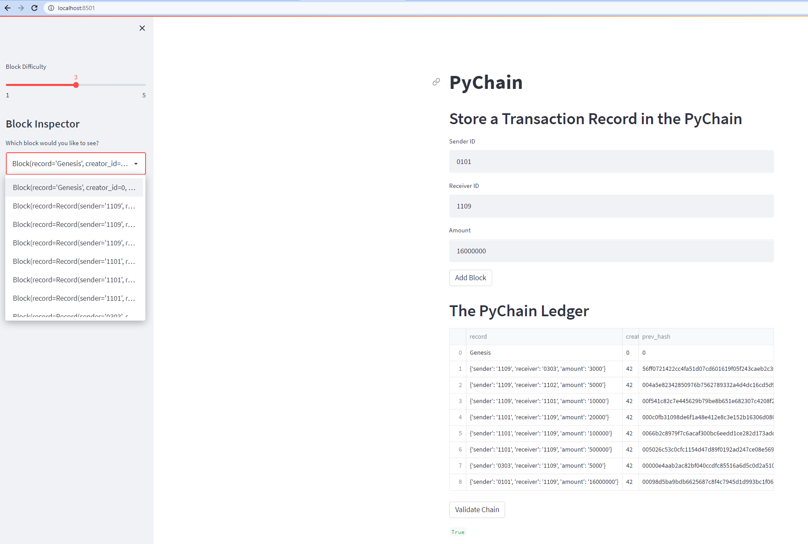

# Module-18-Challenge---Blockchain-with-Python

## Background

You’re a fintech engineer who’s working at one of the five largest banks in the world. You were recently promoted to act as the lead developer on their decentralized finance team. Your task is to build a blockchain-based ledger system, complete with a user-friendly web interface. This ledger will allow partner banks to conduct financial transactions (that is, to transfer money between senders and receivers) and to verify the integrity of the data in the ledger.

## Instruction

Open the provided pychain.py file, which you’ll use to complete the steps for this Challenge. Notice that the PyChain ledger that you built throughout this module already includes the functionality to create blocks, perform the proof of work consensus protocol, and validate blocks in the chain.

The steps for this Challenge are divided into the following sections:

    1.Create a Record Data Class

    2.Modify the Existing Block Data Class to Store Record Data

    3.Add Relevant User Inputs to the Streamlit Interface

    4.Test the PyChain Ledger by Storing Records

## Streamlit

The streamlit app is run form your terminal and open on a localhost. To use this application, open your environement and type: streamlit run pychain.py.

